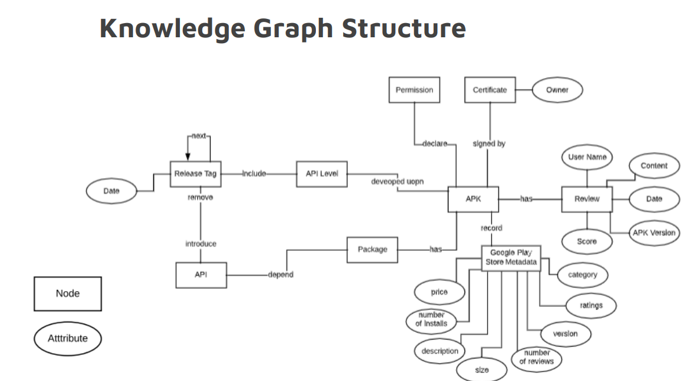
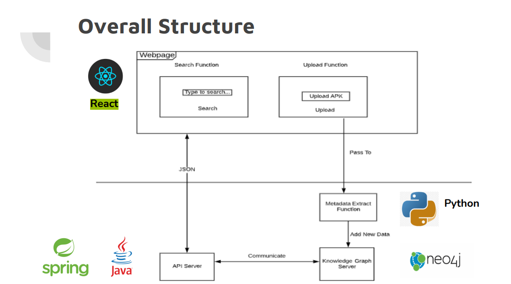

# Knowledge Graph for Android Mobile Applications
Team 8: Smart Search, Mining, and Recommendation

## Background

The project focuses on the Android ecosystem, particularly the challenges and opportunities in the Android OS developed by Google LLC. The Android ecosystem involves app development by various entities and is distributed through platforms like Google Play Store.

The Android ecosystem presents challenges such as open-source modifications, inconsistency due to SDK API modifications, security concerns from third-party developers, and the overwhelming number of apps.

### Question

**How can the Knowledge Graph benefit the analysis and searching of Android mobile applications for Android users, developers, and mobile application researchers?**

 

## KnowledgeZooClient

In this work, the team describes the design and implementation of a reusable tool named KnowledgeZooClient targeting the construction, as a crowd-sourced effort, of a knowledge graph for Android apps. KnowledgeZooClient consists of four modules: 
1. **Metadata Extraction Module:** Extracts metadata from Android apps.
2. **Graph Construction Module:** Imports and integrates extracted metadata into a graph database.
3. **API REST Server:** Connects the graph and provides interfaces to interact with its data.
4. **Web Service Construction Module:** Constructs a front-end service to interact with the graph database.

The usefulness of KnowledgeZooClient is demonstrated via an exclusive knowledge graph called KnowledgeZoo, containing information on over 500,000 apps and still growing. Interested users can already benefit from KnowledgeZoo by writing advanced search queries to collect targeted app samples.

## Methodology

### Working Process
 
     

### Knowledge Graph Structure    
  
   

### Overall Structure
 
    

###  Demonstration :
**

